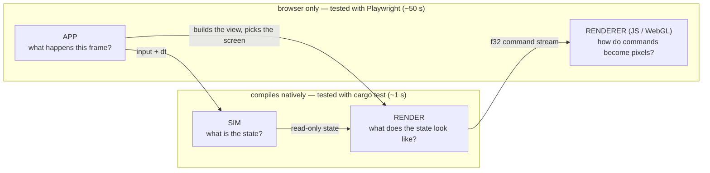

# Architecture — the four layers

Open Miami is four layers. Each answers ONE question, and the question
decides where new code goes. (The frame's data flow — command stream, render
targets, caches — is [PIPELINE.md](PIPELINE.md); this page is about where
CODE lives and why.)

| Layer | Question | May touch | May NOT touch | Where |
|---|---|---|---|---|
| **sim** | What is the state of the world? | the `World`, its components, `dt` | `Graphics`, input, the browser, wall-clock time | `ecs/`, `components/`, `systems/`, `scenario.rs`, `game.rs`, `sim.rs`, `pathfinding.rs`, `collision.rs`, `hud_ammo.rs` / `hud_msg.rs` (HUD *state*), `editor.rs` (the editor *document*) |
| **render** | What does this state look like? | state READ-ONLY + `&Graphics` | input, mutation of game state, the browser, audio | `render.rs`, `render/` (`world`, `hud`, `robots`, `pose` = the robots' joint numbers, `shoggoth` = the boss's spheres, `comms`, `dialogue`, `floor_props`, `title`), `level.rs`, `camera.rs`, the `draw` submodules of `props.rs` / `drive.rs` / `ending.rs`, `sparks::render_sparks` |
| **app** | What happens THIS FRAME? | everything: input, the clock, audio, settings, the URL, `&mut GameState` | — (but it should hold no drawing of its own, see below) | `app.rs`, `app/` (wasm-only), `editor_ui.rs`, `input.rs`, `audio/engine.rs`, `wasm_api.rs` (what the engine exports to the JS tool pages) |
| **renderer** | How do commands become pixels? | the GPU | game state (it only ever sees the stream) | `web/`: `renderer.js` + `renderer/shaders.js`, `ops.js`, `robot-core.js`, `shoggoth-core.js`, `gpu-probe.js` |

## The test for "is this render code?"

> It is a function from state to draw commands: it reads no input, mutates
> nothing, calls no browser API.

If yes, it belongs in the render layer, takes its inputs as plain arguments
(or a view struct such as `render::world::WorldView`), and gets a native
stream test. If no — it decides *which* screen, *when*, reacts to a click,
starts a sound, saves a setting — it is app code.

Two consequences worth stating, because both were real bugs of layering once:

- **Render code never samples input.** The player's SHOOT pose depends on
  the fire button; the app samples it and passes `player_firing: bool`.
- **Render code never reads the mouse either.** The pixel crosshair is drawn
  at `HudView::cursor`; the app samples `input::mouse_position()`.
- **Render code never advances a timer.** The kill flash counts down in the
  app (`GameState::render_world`, the wrapper); the renderer receives the
  seconds left. Same for spark expiry.

**Immediate-mode UI is app code**, legitimately: a button's draw and its
click test are one call (`viz_button`, the menus, `editor_ui`). Those pages
interleave input and drawing by design and stay in `app/`.

## Why the line is drawn there: it is the test boundary

`Graphics` is a RECORDER with two surfaces — the browser canvas (wasm) and
`Graphics::new_headless(w, h)` + `take_frame()` (native). Everything on the
native side of the diagram runs under `cargo test`:

- `src/graphics/stream.rs` decodes a recorded frame (`walk`), validates it
  structurally (`check`: opcode arity, finite floats, balanced SAVE/RESTORE
  and pixel groups within `PIX_DEPTH`, framed solid-only static sections,
  valid TEXT indices) and mirrors the JS transform stack (`Affine`). Its
  tests also pin the Rust opcode table to `renderer.js` and the e2e helpers.
- `tests/render_stream.rs` records the REAL `render_world` on every floor
  (cached / referenced / debug / kill-flash frames, `?pixel=2|3|6`), the
  REAL `render_hud` (every floor's opening scenario — dialogue, captions,
  gate prompts —, death / debug / restart / extraction-card states) and
  every prop at every art-pixel size.

So the rule is not aesthetic: **code in the render layer costs ~1 s to
verify, code in the app layer costs a ~50 s browser round trip and can only
be checked by pixels.** Keep the app layer thin; do not gate a module
`cfg(target_arch = "wasm32")` merely because it takes a `&Graphics`.

What genuinely needs the browser, and nothing else should: `input.rs`
(DOM events), `audio/engine.rs` (WebAudio — it still COMPILES natively, against a
recording mock, for its tests), `editor_ui.rs` + `app/` (they read input), and the `Graphics` surface methods (`new`, `sync_size`,
`flush`).

## Inside the app layer

`app.rs` owns `GameState` (fields private to the `app` tree), the screen
dispatch (`update`), floor load / checkpoints, and the wasm entry (`start`
+ the `requestAnimationFrame` loop). Submodules `use super::*` and add
their own `impl GameState` blocks:

| Module | Holds |
|---|---|
| `game_loop` | `update_game`, the SPINE of an in-game frame — the ORDER of its phases is the behaviour, and the `?perf` span guards live there: camera → input → debug keys → `sim::GameSystems::step` → scenario + elevators → `render_world` → events → `render_hud` → extraction → restart; plus the boss intro and the ending |
| `game_input` | the input-side phases: `update_camera` (it needs the mouse), `handle_player_input` (conversations, tutorial gates, holds, combat), `handle_debug_keys` |
| `game_events` | the event-side phases: `bridge_events_to_scenario` (gate release, checkpoint snapshot), `play_event_sfx` (the per-weapon one-shots, capped per kind per frame), `play_transition_sfx` (death, mask crack, floor clear) |
| `world_render` | the WRAPPER around `render::world::render_world`: the frame's two state changes + building the `WorldView` |
| `menus` | level select, the modal chrome, SETTINGS / ABOUT / PAUSE |
| `viz`, `viz/{effects,props_page,musics}` | the `?viz` toolbox |
| `url`, `perf` | query parameters, the `?perf` spans |

**Every frame must draw a screen.** A screen's `update_*` handles input AND
draws; a transition (`self.screen = …`, `pause_in_settings = …`) takes effect
AFTER the current screen has been drawn — record the intent, draw, then
switch. Switching and returning early ships a frame of NEITHER screen: a bare
CLEAR on the title, or — from PAUSED, where the world is already recorded —
the raw world with no modal and no static, a visible one-frame flash. Do not
"fix" that by re-dispatching to the new screen in the same frame: it would
see the same key press (Esc would pause and un-pause at once).
`tests/e2e/specs/menu-transitions.spec.js` drives the menus and requires
that no frame of the sequence lacks its POSTFX.

The simulation tick itself is shared, not duplicated: the browser loop and
the headless `sim::Simulation` both call `sim::GameSystems::step` /
`sim::gate_frozen_step`, so gameplay verified natively is the gameplay that
ships.

## Known debt (honest list)

- `update_game` (src/app/game_loop.rs) is a ~110-line spine of named phases
  (it was one 510-line function); both frames it shows are pure
  render-layer functions (`render::world::render_world`,
  `render::hud::render_hud`). The phases themselves (`app/game_input.rs`,
  `app/game_events.rs`) are app code by nature — they read input and play
  sounds — so they are only reachable by Playwright; what could be
  host-tested was moved out long ago (the shared tick, the gate dispatch in
  game.rs, the scenario).
- `web/renderer.js`'s `initRenderer` BATCH CORE is one ~1550-line closure (it was ~2,100),
  and that is a DECISION, not debt to pay down blindly. The dependency graph
  was measured before deciding: ~30 mutable closure variables (`m` — which
  `tSave` / `tRestore` REASSIGN —, `vCount`, `pix`, `batchFbo`, `boundTex`,
  …) are touched by nearly all of its inner functions, and `vert` — called
  per vertex — reads four of them. Splitting THAT into modules means a shared
  context object: every one of those reads becomes a property load in the
  hottest loop of a renderer tuned on a fill-rate-poor GPU. What could leave
  has left: the GLSL (`renderer/shaders.js`), the opcode table (`ops.js`),
  and the three subsystems that OWN their state, as factories —
  `renderer/text.js`, `renderer/backgrounds.js`, `renderer/postfx.js`. They
  take `gl` and a handful of batch functions (`flush`, `quad`, `setTexture`,
  `bindBatchState`) from the core ONCE — plain function references, as cheap
  as closure calls — plus one callback each way where they touch live batch
  state (`batchView()` for the backdrop's occlusion path, `handBack()` after
  a post pass). Proven pixel-identical: the 124 `FP` hashes of the
  renderer-only tests, before / after each of the three moves. What is left
  in the closure (pixel groups, the static cache, the sprite atlases, the
  primitives) shares the hot state and stays.
- `audio/engine.rs` + `audio/engine/*` builds live WebAudio node graphs, so
  it SHIPS on wasm only — but it is host-tested through a seam,
  `audio/engine/webaudio.rs` (what `Graphics::new_headless` is to drawing):
  the engine names every Web Audio type through it; on wasm they are the
  `web_sys` types (re-exports — the release `.wasm` is identical to the
  pre-seam build but for six panic line numbers), under `cargo test` a
  RECORDING MOCK with the same names and the subset of methods the engine
  calls. `audio/engine/tests.rs` runs the REAL builders natively — every SFX
  bake, every note voice of every song, the live buses, live one-shots — and
  asserts what a recipe can silently break (the engine swallows every Web
  Audio error by design): an exponential ramp to <= 0 (throws: the envelope
  is just missing), an oscillator never stopped, a node reaching no
  destination, an event in the past, a sound longer than its bake length.
  What stays untested: how it SOUNDS, and the async bake plumbing (promises,
  the pump) — the mock's offline render never resolves.
- One mirror is still pinned only in the browser: the robot rig's rotation
  order (`leg()` / `arm()` <-> `rigVS`, held by `rig-parity.js`). Every other
  mirrored constant has a `cargo test` (the DRIVE scene geometry + hash got
  theirs last: `drive::tests::the_js_mirror_matches`).

## Characters: Rust computes poses, GLSL evaluates rigs, JS ferries

The rule for both characters (the record of how each was moved out of JS, and
how each move was proven bit-exact: [HISTORY.md](HISTORY.md)):

> **Rust computes poses (numbers). GLSL evaluates the rig. JS only ferries.**

- **Robots.** `pose_plan` in `src/render/pose.rs` is THE ONE pose
  implementation; the kick / stomp timing derives from
  `FinisherKind::impacts()`. The `ROBOT` and `PORTRAIT` ops carry its 11
  scalars + flags (order = `POSE_SCALARS` in web/robot-core.js, unpacked by
  `planFromScalars`); web/robot-core.js REQUIRES `opts.plan`. Pins:
  `scalar_order_matches_the_js`, `flag_bits_match_the_js`,
  `no_js_pose_logic_is_left`, and the frozen golden record
  `tests/fixtures/pose_plan.txt` (`matches_the_golden_record` — a deliberate
  pose change updates its rows in the same commit).
- **The boss.** `boss_spheres` in `src/render/shoggoth.rs` places every sphere
  and runs the wander behaviour (the mask's look-up beats in-game come from
  it), as a pure function of time. It crosses as a run of `SPHERE` ops (20
  floats each) closed by `SHOGGOTH x y sizePx maskAt`; web/shoggoth-core.js
  only draws that list — TWO instanced draws (body depth-ON, then the mask
  depth-OFF, in submission order: never merge them), the per-sphere path kept
  as the REFERENCE (`pipe.instanced = false`), held pixel-identical by
  `tests/e2e/render/shoggoth-parity.js`. KEEP the f32-rounded matrix maths and
  the truncated literals (`6.283`, not `TAU`): the golden record
  `tests/fixtures/shoggoth_spheres.txt` depends on them. Pins:
  `the_sphere_layout_matches_the_op_and_the_js`, `no_js_boss_animation_is_left`.
- **Tools** (`tools/inspector.html`, `rig-parity.html`, `shoggoth-parity.html`)
  get poses from the wasm: `tools/engine-pose.js` -> `src/wasm_api.rs`. Loading
  the wasm does not start the game (`start` is explicit). Cost accepted: pose
  look-dev needs `make build-wasm`.
- What the JS still decides about a character is how it is LIT, INKED and
  FRAMED — renderer questions by the layering above. Never add character
  animation to JS.

## What's next

OPEN — the music engine v2 (in: the format, the engine, the eleven v2 songs
— tracker-only —, the `compose` builders for the whole format with
`sodium_lights.rs` as the tour; record: HISTORY.md):

1. MORE INSTRUMENT: computed voices (a plucked string / bass, a bowed
   string — sample-by-sample Rust into the bake buffer, which Web Audio
   nodes cannot do: a feedback loop's minimum delay caps Karplus-Strong
   near 340 Hz), per-note start → end modifiers (pitch bend, cutoff
   sweep), a tempo-synced filter LFO (the wobble), per-section ramps on
   the live lane channels (a filter opening over 16 bars, a rising send)
   — and one track each to show them (guitar / bass / violin; a wobble
   one; a slow-burn one).
2. A PRODUCT DECISION, not code: which songs the game PLAYS. The roles
   still name the seven briefed tracks; the v2 songs are 27–80 s loops with
   no role. Options: give v2 songs roles, extend them to briefed lengths,
   or re-voice the briefed tracks with v2 instruments (the builders can
   now: `.voices(..)`, ties, accents).
3. The ten remaining `const`-literal songs could be rewritten with the
   builders like Sodium Lights was (pin the fingerprint first, as
   `the_compose_rewrite_of_sodium_lights_is_the_same_song` does).

Done before that (HISTORY.md): the
renderer-only pixel tests, the DRIVE mirror pin, the renderer's subsystems as
factories, host tests for the WebAudio engine, the `update_game` split.

What is knowingly NOT covered (docs/TESTING.md, "Not covered"): how the audio
SOUNDS and its async bake plumbing; `src/app/` beyond what the Playwright
specs drive; the robot rig's rotation order is pinned in the browser only
(`rig-parity.js`). None of it is planned work — add an item here when one is.
