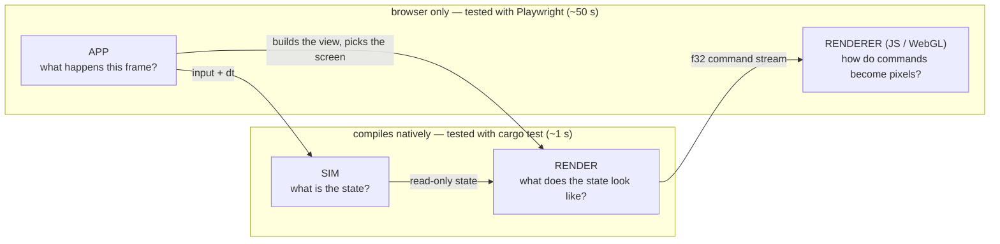

# Architecture — the four layers

Open Miami is four layers. Each answers ONE question, and the question
decides where new code goes. (The frame's data flow — command stream, render
targets, caches — is [PIPELINE.md](PIPELINE.md); this page is about where
CODE lives and why.)

| Layer | Question | May touch | May NOT touch | Where |
|---|---|---|---|---|
| **sim** | What is the state of the world? | the `World`, its components, `dt` | `Graphics`, input, the browser, wall-clock time | `ecs/`, `components/`, `systems/`, `scenario.rs`, `game.rs`, `sim.rs`, `pathfinding.rs`, `collision.rs`, `hud_ammo.rs` / `hud_msg.rs` (HUD *state*), `editor.rs` (the editor *document*) |
| **render** | What does this state look like? | state READ-ONLY + `&Graphics` | input, mutation of game state, the browser, audio | `render.rs`, `render/` (`world`, `hud`, `robots`, `pose` = the robots' joint numbers, `shoggoth` = the boss's spheres, `comms`, `dialogue`, `floor_props`, `title`), `level.rs`, `camera.rs`, the `draw` submodules of `props.rs` / `drive.rs` / `ending.rs`, `sparks::render_sparks` |
| **app** | What happens THIS FRAME? | everything: input, the clock, audio, settings, the URL, `&mut GameState` | — (but it should hold no drawing of its own, see below) | `app.rs`, `app/` (wasm-only), `editor_ui.rs`, `input.rs`, `audio/engine.rs`, `wasm_api.rs` (what the engine exports to the JS tool pages) |
| **renderer** | How do commands become pixels? | the GPU | game state (it only ever sees the stream) | `web/`: `renderer.js` + `renderer/shaders.js`, `ops.js`, `robot-core.js`, `shoggoth-core.js`, `gpu-probe.js` |

## The test for "is this render code?"

> It is a function from state to draw commands: it reads no input, mutates
> nothing, calls no browser API.

If yes, it belongs in the render layer, takes its inputs as plain arguments
(or a view struct such as `render::world::WorldView`), and gets a native
stream test. If no — it decides *which* screen, *when*, reacts to a click,
starts a sound, saves a setting — it is app code.

Two consequences worth stating, because both were real bugs of layering once:

- **Render code never samples input.** The player's SHOOT pose depends on
  the fire button; the app samples it and passes `player_firing: bool`.
- **Render code never reads the mouse either.** The pixel crosshair is drawn
  at `HudView::cursor`; the app samples `input::mouse_position()`.
- **Render code never advances a timer.** The kill flash counts down in the
  app (`GameState::render_world`, the wrapper); the renderer receives the
  seconds left. Same for spark expiry.

**Immediate-mode UI is app code**, legitimately: a button's draw and its
click test are one call (`viz_button`, the menus, `editor_ui`). Those pages
interleave input and drawing by design and stay in `app/`.

## Why the line is drawn there: it is the test boundary

`Graphics` is a RECORDER with two surfaces — the browser canvas (wasm) and
`Graphics::new_headless(w, h)` + `take_frame()` (native). Everything on the
native side of the diagram runs under `cargo test`:

- `src/graphics/stream.rs` decodes a recorded frame (`walk`), validates it
  structurally (`check`: opcode arity, finite floats, balanced SAVE/RESTORE
  and pixel groups within `PIX_DEPTH`, framed solid-only static sections,
  valid TEXT indices) and mirrors the JS transform stack (`Affine`). Its
  tests also pin the Rust opcode table to `renderer.js` and the e2e helpers.
- `tests/render_stream.rs` records the REAL `render_world` on every floor
  (cached / referenced / debug / kill-flash frames, `?pixel=2|3|6`), the
  REAL `render_hud` (every floor's opening scenario — dialogue, captions,
  gate prompts —, death / debug / restart / extraction-card states) and
  every prop at every art-pixel size.

So the rule is not aesthetic: **code in the render layer costs ~1 s to
verify, code in the app layer costs a ~50 s browser round trip and can only
be checked by pixels.** Keep the app layer thin; do not gate a module
`cfg(target_arch = "wasm32")` merely because it takes a `&Graphics`.

What genuinely needs the browser, and nothing else should: `input.rs`
(DOM events), `audio/engine.rs` (WebAudio), `editor_ui.rs` + `app/` (they
read input), and the `Graphics` surface methods (`new`, `sync_size`,
`flush`).

## Inside the app layer

`app.rs` owns `GameState` (fields private to the `app` tree), the screen
dispatch (`update`), floor load / checkpoints, and the wasm entry (`start`
+ the `requestAnimationFrame` loop). Submodules `use super::*` and add
their own `impl GameState` blocks:

| Module | Holds |
|---|---|
| `game_loop` | `update_game`: input → `sim::GameSystems::step` → scenario / event / audio bridge → builds the `HudView` → transitions; the boss intro; the ending |
| `world_render` | the WRAPPER around `render::world::render_world`: the frame's two state changes + building the `WorldView` |
| `menus` | level select, the modal chrome, SETTINGS / ABOUT / PAUSE |
| `viz`, `viz/{effects,props_page,musics}` | the `?viz` toolbox |
| `url`, `perf` | query parameters, the `?perf` spans |

**Every frame must draw a screen.** A screen's `update_*` handles input AND
draws; a transition (`self.screen = …`, `pause_in_settings = …`) takes effect
AFTER the current screen has been drawn — record the intent, draw, then
switch. Switching and returning early ships a frame of NEITHER screen: a bare
CLEAR on the title, or — from PAUSED, where the world is already recorded —
the raw world with no modal and no static, a visible one-frame flash. Do not
"fix" that by re-dispatching to the new screen in the same frame: it would
see the same key press (Esc would pause and un-pause at once).
`tests/e2e/specs/menu-transitions.spec.js` drives the menus and requires
that no frame of the sequence lacks its POSTFX.

The simulation tick itself is shared, not duplicated: the browser loop and
the headless `sim::Simulation` both call `sim::GameSystems::step` /
`sim::gate_frozen_step`, so gameplay verified natively is the gameplay that
ships.

## Known debt (honest list)

- `update_game` (src/app/game_loop.rs) is still one long function, but it
  no longer DRAWS: input -> the shared tick -> the event / audio bridge ->
  building `WorldView` + `HudView` -> screen transitions. Both frames it
  shows are pure render-layer functions (`render::world::render_world`,
  `render::hud::render_hud`). What is left to split is orchestration
  (input handling, the event-to-sound bridge) — app code by nature, only
  reachable by Playwright.
- `web/renderer.js`'s `initRenderer` is one ~1,650-line closure, and that is
  a DECISION, not debt to pay down blindly. The dependency graph was
  measured before deciding: ~30 mutable closure variables (`m` — which
  `tSave` / `tRestore` REASSIGN —, `vCount`, `pix`, `batchFbo`, `boundTex`,
  …) are touched by nearly all 54 inner functions, and `vert` — called per
  vertex — reads four of them. Splitting it into modules means a shared
  context object: every one of those reads becomes a property load in the
  hottest loop of a renderer tuned on a fill-rate-poor GPU, across code
  whose pixels are only partly under test (postfx kinds, text, the drive
  have no pixel test). What WAS pure data is out: the GLSL
  (`renderer/shaders.js`) and the opcode table (`ops.js`). A further split
  should start with the subsystems that own their state — postfx + warp,
  drive + backdrop, the glyph atlas — as factories, each with a pixel test
  first.
- `audio/engine.rs` + `audio/engine/*` is split by concern but stays
  browser-only: unlike `Graphics` it is not a recorder — it builds live
  WebAudio node graphs — so none of the SFX / voice recipes are host-tested
  (the sequencer, song data and bake specs in `audio/songs.rs` /
  `compose.rs` / `sfx.rs` are). A recording `AudioGraph` seam would fix
  that; it is a real design change, not a move.
- Mirrored constants without a test yet: the drive scene geometry
  (`drive.rs` ↔ `DRIVE_FS`) and the robot rig's rotation order
  (`leg()` / `arm()` ↔ `rigVS`, covered by `rig-parity.js` in the browser).

## Roadmap — characters: Rust computes poses, GLSL evaluates rigs, JS ferries (COMPLETE)

STATUS: DONE, every step below. This section is kept as the record of WHY
the characters are built the way they are and HOW each move was proven — read
it before touching `render/pose.rs`, `render/shoggoth.rs`, `web/robot-core.js`
or `web/shoggoth-core.js`. For what is still open, see "What's next" at the
end of this page.

WHERE IT STARTED: the robots and the boss were the one place where the
layering was not settled — their ANIMATION (what the body does at time `t`)
lived in JS, outside the native test boundary. The target was one rule for
both characters:

> **Rust computes poses (numbers). GLSL evaluates the rig. JS only ferries.**

Neither extreme is the goal. "All Rust" is impossible — the skeleton and
the inking must run on the GPU, so they stay GLSL. "All JS" is today, and
it has a real coupling: Rust owns the finisher timers and impact frames
(`FinisherKind::impacts`), JS owns the kick / stomp keyframes that must line
up with them — gameplay choreography mirrored across two languages, pinned by
nothing. What moves is only the middle piece: `(pose, time)` -> joint
numbers, which by the test above is render-layer code.

Where each character STOOD at the start (historical):

- **Robots — the seam already existed.** `posePlan(pose, time, relaxed)` in
  `web/robot-core.js` is a PURE ~150-line function (no state, no randomness,
  no browser) returning a handful of scalars, and the GPU rig (`rigVS`)
  already consumes exactly that: 16 floats per instance. The interface is
  there; it just sits between two pieces of JS.
- **The boss — no seam yet.** `web/shoggoth-core.js` builds a matrix per
  sphere on the CPU and issues one draw per sphere; there is no "pose
  numbers" layer to cut along. (The command is already minimal — 6 floats,
  `x y size heading reveal time` — so this is about where the expansion
  runs, not about stream size.) (This page first claimed here that its
  small wander state machine was only the inspector's preview. WRONG — see
  step 3: the game takes the mask's look-up beats from it.)

Planned order (each step lands with its test FIRST):

1. **Robots: port `posePlan` to Rust** — DONE, in three sub-steps:
   - **R1 (DONE): the port + the proof, no runtime change.**
     `src/render/pose.rs` (`pose_plan`, `PoseKind`, `Pose`) reproduced the JS
     BIT-EXACTLY: `tests/fixtures/pose_plan.txt` was generated FROM
     `posePlan()` (every pose x relaxed x 54 times) and all 9,504 scalars
     compared (measured: max difference 0). The kick / stomp timing DERIVES
     from `FinisherKind::impacts()` and is tested ("the foot is fully
     extended on the impact", "each stomp lands on its impact").
   - **R2 (DONE): the game uses it.** The `ROBOT` op is `colorIdx weaponIdx
     flags x y angle sizePx` + the 11 pose scalars (18 args; flags bit 0 =
     the gun hand aims, bit 1 = headless): `render/robots.rs` calls
     `pose_plan`, the renderer unpacks with `planFromScalars` and
     `batchDraw` takes the ready-made `opts.plan` — the game runs NO JS
     animation any more, and renderer.js lost its `ROBOT_POSES` table. The
     scalar ORDER is one JS list, `POSE_SCALARS` (web/robot-core.js), which
     drives both the renderer's unpack and the fixture's columns; Rust is
     held to it by `scalar_order_matches_the_js` (+ `flag_bits_match_the_js`). Since R1 proved the two pose
     functions bit-identical, the game's robots are unchanged by
     construction. JS `posePlan()` now only serves the tools + the bakes.
   - **R3 (DONE): the JS copy is DELETED — one pose implementation.**
     `posePlan()` and the `POSES` name list are gone from web/robot-core.js,
     whose `render()` / `batchDraw()` / `bakeSprite()` now REQUIRE
     `opts.plan`. The three places that had no engine got one: the portrait
     bake receives its pose IN the `PORTRAIT` op (`portrait_pose()`, 11
     scalars + flags — renderer.js stays wasm-free, as the render-tests
     harness needs), and `tools/inspector.html` + `tools/rig-parity.html`
     load the wasm through `tools/engine-pose.js` and call the exports of
     `src/wasm_api.rs` (`pose_names`, `pose_plan_scalars` — the ENGINE also
     decides "unarmed = at ease", so that rule is not duplicated either).
     Loading the wasm does not start the game (`start` is explicit). The
     fixture is now a FROZEN golden record (`matches_the_golden_record`); its
     generator and `make gen-pose` / `check-pose` are gone with the JS they
     read. Pins: `scalar_order_matches_the_js`, `flag_bits_match_the_js`,
     `no_js_pose_logic_is_left`. Cost accepted: pose look-dev in the
     inspector needs `make build-wasm` (so do the tools at all).

   Payoff: choreography in one language, host-testable.
2. **Boss: instanced spheres, still in JS** — DONE. Every sphere the boss
   draws went through one choke point (`_sphere(model, colour, accent, id,
   emission)`), so a sphere became 20 per-INSTANCE floats (the model's three
   rows + two colour vec4s) and a frame became TWO instanced draws: the body
   with the depth test on, then the mask assembly with it OFF, in submission
   order — the mask is drawn depth-off on purpose, so ONE draw was not an
   option. MEASURED on the parity page: the per-sphere path submitted up to
   227 draws a frame (124 on average, six uniform uploads each); the
   instanced path submits 2. The original path stays as the REFERENCE
   (`pipe.instanced = false`; also the fallback without
   ANGLE_instanced_arrays), exactly like the robots' CPU rig. The "normal
   matrix" is the model's upper 3x3 as is (not an inverse-transpose — the
   look was tuned with it), derived in the shader from the same rows.
   `tools/shoggoth-parity.html` + `tests/e2e/render/shoggoth-parity.js` (in
   `make check-render`) render the whole mask-off arc x clocks / headings +
   the orbit camera, the wander drift and the fine tessellation through
   both, at the game's tile settings: 45 frames, 0 differing pixels; they
   also assert <= 2 scene draws, no GL error and NO instancing divisor left
   on the context. Mutation-tested (a shifted sphere; the mask drawn WITH
   depth) — both fail it. This is the boss's FIRST pixel test, and the seam
   step 3 needs: the instance list is what Rust will fill.
3. **Boss: move the sphere placement to Rust** — DONE.
   `src/render/shoggoth.rs` (`boss_spheres(&BossPose) -> BossSpheres`) places
   every sphere — mass, tentacles, dot eyes, the mask and its break-up — AND
   runs the WANDER behaviour. (A correction to an earlier belief: that little
   state machine is not an inspector toy. The game never passes `lookUp`, so
   the mask's "stop and look up" beats in-game come from it; it was ported
   faithfully, and made a pure function of time — the JS cached its state and
   so depended on the order it was queried in.) Proven BIT-EXACT before the JS
   was deleted: the placement code was run under Bun with a mock GL and its
   sphere queue captured (13 frames, 1,609 spheres, 32,180 floats — max
   difference 0); `tests/fixtures/shoggoth_spheres.txt` is the compact frozen
   golden record (`matches_the_golden_record`). What made bit-exactness
   possible, and must be kept: the JS matrices lived in `Float32Array`s, so
   every product was ROUNDED TO f32 at each step (mirrored in Rust), and the
   original's truncated literals (`6.283`, not `TAU`) are kept on purpose.
   WIRE FORMAT: a run of `SPHERE` ops (20 floats each) closed by
   `SHOGGOTH x y sizePx maskAt`, which consumes it — fixed-arity ops, so every
   stream walker keeps working; `graphics::stream::check` validates the run
   (closed, never interrupted, split inside it). web/shoggoth-core.js went
   620 -> 337 lines: camera, shading, the two draw paths, NO animation — its
   instanced path uploads the engine's list AS the instance buffer.
   `BOSS_MASK_OFF_SECS` is now the one definition (the JS constant and its
   pin are gone). Tools: `bossSpheres()` / `MASK_OFF_SECS` in
   tools/engine-pose.js -> `src/wasm_api.rs`. Pins:
   `the_sphere_layout_matches_the_op_and_the_js`,
   `no_js_boss_animation_is_left`.
4. **Tools load the wasm for poses** — DONE, robots (R3) and boss (step 3).

Costs accepted knowingly: look-dev on a pose goes from edit + refresh to a
wasm rebuild (15 s release today; a dev-profile build should cut that — not
yet measured), and the tools pages gain a wasm dependency. Decide robots and
boss TOGETHER — moving only one leaves two conventions, which is worse than
either.

THE ROADMAP IS COMPLETE: no character animation is left in JS. What the JS
still decides about a character is how it is LIT, INKED and FRAMED — renderer
questions by the layering above.

## What's next (open work, in the order I would take it)

Everything the refactor set out to do is done; nothing below is urgent, and
each item is optional. A new session can start from this list.

1. **Pixel tests for the renderer's untested subsystems** — the postfx kinds,
   text (the glyph atlas) and the DRIVE backdrop have none (docs/TESTING.md,
   "Not covered"). Cheap, in the style of `tests/e2e/render/*.js`, and the
   precondition for item 3. Highest value per hour.
2. **Pin the last unpinned mirror: the DRIVE scene geometry** (`src/drive.rs`
   tunables <-> `DRIVE_FS` in web/renderer/shaders.js) — a `cargo test` that
   parses the shader's constants, like the opcode / pose / sphere pins.
3. **The renderer's self-contained subsystems as factories** (postfx + warp,
   drive + backdrop, the glyph atlas) — ONLY behind item 1's pixel tests, and
   never the batch core: see "Known debt" for why `initRenderer` stays one
   closure.
4. **Host tests for the WebAudio engine** — needs a recording `AudioGraph`
   seam (what `Graphics::new_headless` is to drawing). A real design change;
   worth it only if the SFX / voice recipes start changing often.
5. **Splitting `update_game`'s orchestration** (input handling, the
   event-to-sound bridge) — app code by nature, reachable only by Playwright,
   so the payoff is readability, not testability. Lowest priority.

Housekeeping that is NOT code: run `claude` inside `tmux` on the dev box. A
dropped SSH connection otherwise leaves the session running unreachable, and
`claude --continue` then starts a SECOND agent on the same working tree (it
happened during the boss port; the two forks even shared one transcript).
