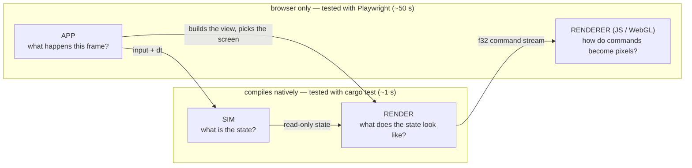

# Architecture — the four layers

Open Miami is four layers. Each answers ONE question, and the question
decides where new code goes. (The frame's data flow — command stream, render
targets, caches — is [PIPELINE.md](PIPELINE.md); this page is about where
CODE lives and why.)

| Layer | Question | May touch | May NOT touch | Where |
|---|---|---|---|---|
| **sim** | What is the state of the world? | the `World`, its components, `dt` | `Graphics`, input, the browser, wall-clock time | `ecs/`, `components/`, `systems/`, `scenario.rs`, `game.rs`, `sim.rs`, `pathfinding.rs`, `collision.rs`, `hud_ammo.rs` / `hud_msg.rs` (HUD *state*), `editor.rs` (the editor *document*) |
| **render** | What does this state look like? | state READ-ONLY + `&Graphics` | input, mutation of game state, the browser, audio | `render.rs`, `render/` (`world`, `robots`, `comms`, `dialogue`, `floor_props`, `title`), `level.rs`, `camera.rs`, the `draw` submodules of `props.rs` / `drive.rs` / `ending.rs`, `sparks::render_sparks` |
| **app** | What happens THIS FRAME? | everything: input, the clock, audio, settings, the URL, `&mut GameState` | — (but it should hold no drawing of its own, see below) | `app.rs`, `app/` (wasm-only), `editor_ui.rs`, `input.rs`, `audio/engine.rs` |
| **renderer** | How do commands become pixels? | the GPU | game state (it only ever sees the stream) | `renderer.js`, `robot-core.js`, `shoggoth-core.js` |

## The test for "is this render code?"

> It is a function from state to draw commands: it reads no input, mutates
> nothing, calls no browser API.

If yes, it belongs in the render layer, takes its inputs as plain arguments
(or a view struct such as `render::world::WorldView`), and gets a native
stream test. If no — it decides *which* screen, *when*, reacts to a click,
starts a sound, saves a setting — it is app code.

Two consequences worth stating, because both were real bugs of layering once:

- **Render code never samples input.** The player's SHOOT pose depends on
  the fire button; the app samples it and passes `player_firing: bool`.
- **Render code never advances a timer.** The kill flash counts down in the
  app (`GameState::render_world`, the wrapper); the renderer receives the
  seconds left. Same for spark expiry.

**Immediate-mode UI is app code**, legitimately: a button's draw and its
click test are one call (`viz_button`, the menus, `editor_ui`). Those pages
interleave input and drawing by design and stay in `app/`.

## Why the line is drawn there: it is the test boundary

`Graphics` is a RECORDER with two surfaces — the browser canvas (wasm) and
`Graphics::new_headless(w, h)` + `take_frame()` (native). Everything on the
native side of the diagram runs under `cargo test`:

- `src/graphics/stream.rs` decodes a recorded frame (`walk`), validates it
  structurally (`check`: opcode arity, finite floats, balanced SAVE/RESTORE
  and pixel groups within `PIX_DEPTH`, framed solid-only static sections,
  valid TEXT indices) and mirrors the JS transform stack (`Affine`). Its
  tests also pin the Rust opcode table to `renderer.js` and the e2e helpers.
- `tests/render_stream.rs` records the REAL `render_world` on every floor
  (cached / referenced / debug / kill-flash frames, `?pixel=2|3|6`) and
  every prop at every art-pixel size.

So the rule is not aesthetic: **code in the render layer costs ~1 s to
verify, code in the app layer costs a ~50 s browser round trip and can only
be checked by pixels.** Keep the app layer thin; do not gate a module
`cfg(target_arch = "wasm32")` merely because it takes a `&Graphics`.

What genuinely needs the browser, and nothing else should: `input.rs`
(DOM events), `audio/engine.rs` (WebAudio), `editor_ui.rs` + `app/` (they
read input), and the `Graphics` surface methods (`new`, `sync_size`,
`flush`).

## Inside the app layer

`app.rs` owns `GameState` (fields private to the `app` tree), the screen
dispatch (`update`), floor load / checkpoints, and the wasm entry (`start`
+ the `requestAnimationFrame` loop). Submodules `use super::*` and add
their own `impl GameState` blocks:

| Module | Holds |
|---|---|
| `game_loop` | `update_game`: input → `sim::GameSystems::step` → scenario bridge → HUD / comms; the boss intro; the ending |
| `world_render` | the WRAPPER around `render::world::render_world`: the frame's two state changes + building the `WorldView` |
| `menus` | level select, the modal chrome, SETTINGS / ABOUT / PAUSE |
| `viz`, `viz/{effects,props_page,musics}` | the `?viz` toolbox |
| `url`, `perf` | query parameters, the `?perf` spans |

The simulation tick itself is shared, not duplicated: the browser loop and
the headless `sim::Simulation` both call `sim::GameSystems::step` /
`sim::gate_frozen_step`, so gameplay verified natively is the gameplay that
ships.

## Known debt (honest list)

- `update_game` is still one ~600-line function (input, tick, event bridge
  and HUD drawing in sequence). Its HUD / comms drawing half is render code
  by the test above and should move behind a view struct like the world did.
- `renderer.js` is one ~2,300-line closure (split planned, not done).
- `audio/engine.rs` + `audio/engine/*` is split by concern but stays
  browser-only: unlike `Graphics` it is not a recorder — it builds live
  WebAudio node graphs — so none of the SFX / voice recipes are host-tested
  (the sequencer, song data and bake specs in `audio/songs.rs` /
  `compose.rs` / `sfx.rs` are). A recording `AudioGraph` seam would fix
  that; it is a real design change, not a move.
- Mirrored constants without a test yet: the drive scene geometry
  (`drive.rs` ↔ `DRIVE_FS`) and the robot rig's rotation order
  (`leg()` / `arm()` ↔ `rigVS`, covered by `rig-parity.js` in the browser).
