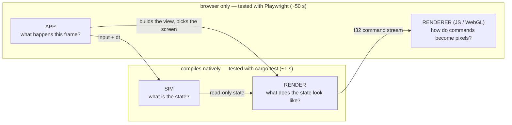

# Architecture — the four layers

Open Miami is four layers. Each answers ONE question, and the question
decides where new code goes. (The frame's data flow — command stream, render
targets, caches — is [PIPELINE.md](PIPELINE.md); this page is about where
CODE lives and why.)

| Layer | Question | May touch | May NOT touch | Where |
|---|---|---|---|---|
| **sim** | What is the state of the world? | the `World`, its components, `dt` | `Graphics`, input, the browser, wall-clock time | `ecs/`, `components/`, `systems/`, `scenario.rs`, `game.rs`, `sim.rs`, `pathfinding.rs`, `collision.rs`, `hud_ammo.rs` / `hud_msg.rs` (HUD *state*), `editor.rs` (the editor *document*) |
| **render** | What does this state look like? | state READ-ONLY + `&Graphics` | input, mutation of game state, the browser, audio | `render.rs`, `render/` (`world`, `hud`, `robots`, `pose` = the robots' joint numbers, `shoggoth` = the boss's spheres, `comms`, `dialogue`, `floor_props`, `title`), `level.rs`, `camera.rs`, the `draw` submodules of `props.rs` / `drive.rs` / `ending.rs`, `sparks::render_sparks` |
| **app** | What happens THIS FRAME? | everything: input, the clock, audio, settings, the URL, `&mut GameState` | — (but it should hold no drawing of its own, see below) | `app.rs`, `app/` (wasm-only), `editor_ui.rs`, `input.rs`, `audio/engine.rs`, `wasm_api.rs` (what the engine exports to the JS tool pages) |
| **renderer** | How do commands become pixels? | the GPU | game state (it only ever sees the stream) | `web/`: `renderer.js` + `renderer/shaders.js`, `ops.js`, `robot-core.js`, `shoggoth-core.js`, `gpu-probe.js` |

## The test for "is this render code?"

> It is a function from state to draw commands: it reads no input, mutates
> nothing, calls no browser API.

If yes, it belongs in the render layer, takes its inputs as plain arguments
(or a view struct such as `render::world::WorldView`), and gets a native
stream test. If no — it decides *which* screen, *when*, reacts to a click,
starts a sound, saves a setting — it is app code.

Two consequences worth stating, because both were real bugs of layering once:

- **Render code never samples input.** The player's SHOOT pose depends on
  the fire button; the app samples it and passes `player_firing: bool`.
- **Render code never reads the mouse either.** The pixel crosshair is drawn
  at `HudView::cursor`; the app samples `input::mouse_position()`.
- **Render code never advances a timer.** The kill flash counts down in the
  app (`GameState::render_world`, the wrapper); the renderer receives the
  seconds left. Same for spark expiry.

**Immediate-mode UI is app code**, legitimately: a button's draw and its
click test are one call (`viz_button`, the menus, `editor_ui`). Those pages
interleave input and drawing by design and stay in `app/`.

## Why the line is drawn there: it is the test boundary

`Graphics` is a RECORDER with two surfaces — the browser canvas (wasm) and
`Graphics::new_headless(w, h)` + `take_frame()` (native). Everything on the
native side of the diagram runs under `cargo test`:

- `src/graphics/stream.rs` decodes a recorded frame (`walk`), validates it
  structurally (`check`: opcode arity, finite floats, balanced SAVE/RESTORE
  and pixel groups within `PIX_DEPTH`, framed solid-only static sections,
  valid TEXT indices) and mirrors the JS transform stack (`Affine`). Its
  tests also pin the Rust opcode table to `renderer.js` and the e2e helpers.
- `tests/render_stream.rs` records the REAL `render_world` on every floor
  (cached / referenced / debug / kill-flash frames, `?pixel=2|3|6`), the
  REAL `render_hud` (every floor's opening scenario — dialogue, captions,
  gate prompts —, death / debug / restart / extraction-card states) and
  every prop at every art-pixel size.

So the rule is not aesthetic: **code in the render layer costs ~1 s to
verify, code in the app layer costs a ~50 s browser round trip and can only
be checked by pixels.** Keep the app layer thin; do not gate a module
`cfg(target_arch = "wasm32")` merely because it takes a `&Graphics`.

What genuinely needs the browser, and nothing else should: `input.rs`
(DOM events), `audio/engine.rs` (WebAudio), `editor_ui.rs` + `app/` (they
read input), and the `Graphics` surface methods (`new`, `sync_size`,
`flush`).

## Inside the app layer

`app.rs` owns `GameState` (fields private to the `app` tree), the screen
dispatch (`update`), floor load / checkpoints, and the wasm entry (`start`
+ the `requestAnimationFrame` loop). Submodules `use super::*` and add
their own `impl GameState` blocks:

| Module | Holds |
|---|---|
| `game_loop` | `update_game`: input → `sim::GameSystems::step` → scenario / event / audio bridge → builds the `HudView` → transitions; the boss intro; the ending |
| `world_render` | the WRAPPER around `render::world::render_world`: the frame's two state changes + building the `WorldView` |
| `menus` | level select, the modal chrome, SETTINGS / ABOUT / PAUSE |
| `viz`, `viz/{effects,props_page,musics}` | the `?viz` toolbox |
| `url`, `perf` | query parameters, the `?perf` spans |

**Every frame must draw a screen.** A screen's `update_*` handles input AND
draws; a transition (`self.screen = …`, `pause_in_settings = …`) takes effect
AFTER the current screen has been drawn — record the intent, draw, then
switch. Switching and returning early ships a frame of NEITHER screen: a bare
CLEAR on the title, or — from PAUSED, where the world is already recorded —
the raw world with no modal and no static, a visible one-frame flash. Do not
"fix" that by re-dispatching to the new screen in the same frame: it would
see the same key press (Esc would pause and un-pause at once).
`tests/e2e/specs/menu-transitions.spec.js` drives the menus and requires
that no frame of the sequence lacks its POSTFX.

The simulation tick itself is shared, not duplicated: the browser loop and
the headless `sim::Simulation` both call `sim::GameSystems::step` /
`sim::gate_frozen_step`, so gameplay verified natively is the gameplay that
ships.

## Known debt (honest list)

- `update_game` (src/app/game_loop.rs) is still one long function, but it
  no longer DRAWS: input -> the shared tick -> the event / audio bridge ->
  building `WorldView` + `HudView` -> screen transitions. Both frames it
  shows are pure render-layer functions (`render::world::render_world`,
  `render::hud::render_hud`). What is left to split is orchestration
  (input handling, the event-to-sound bridge) — app code by nature, only
  reachable by Playwright.
- `web/renderer.js`'s `initRenderer` is one ~1,650-line closure, and that is
  a DECISION, not debt to pay down blindly. The dependency graph was
  measured before deciding: ~30 mutable closure variables (`m` — which
  `tSave` / `tRestore` REASSIGN —, `vCount`, `pix`, `batchFbo`, `boundTex`,
  …) are touched by nearly all 54 inner functions, and `vert` — called per
  vertex — reads four of them. Splitting it into modules means a shared
  context object: every one of those reads becomes a property load in the
  hottest loop of a renderer tuned on a fill-rate-poor GPU, across code
  whose pixels were only partly under test when this was decided (postfx
  kinds, text and the drive got their pixel tests since: docs/TESTING.md). What WAS pure data is out: the GLSL
  (`renderer/shaders.js`) and the opcode table (`ops.js`). A further split
  should start with the subsystems that own their state — postfx + warp,
  drive + backdrop, the glyph atlas — as factories, each with a pixel test
  first.
- `audio/engine.rs` + `audio/engine/*` is split by concern but stays
  browser-only: unlike `Graphics` it is not a recorder — it builds live
  WebAudio node graphs — so none of the SFX / voice recipes are host-tested
  (the sequencer, song data and bake specs in `audio/songs.rs` /
  `compose.rs` / `sfx.rs` are). A recording `AudioGraph` seam would fix
  that; it is a real design change, not a move.
- Mirrored constants without a test yet: the drive scene geometry
  (`drive.rs` ↔ `DRIVE_FS`) and the robot rig's rotation order
  (`leg()` / `arm()` ↔ `rigVS`, covered by `rig-parity.js` in the browser).

## Characters: Rust computes poses, GLSL evaluates rigs, JS ferries

The rule for both characters (the record of how each was moved out of JS, and
how each move was proven bit-exact: [HISTORY.md](HISTORY.md)):

> **Rust computes poses (numbers). GLSL evaluates the rig. JS only ferries.**

- **Robots.** `pose_plan` in `src/render/pose.rs` is THE ONE pose
  implementation; the kick / stomp timing derives from
  `FinisherKind::impacts()`. The `ROBOT` and `PORTRAIT` ops carry its 11
  scalars + flags (order = `POSE_SCALARS` in web/robot-core.js, unpacked by
  `planFromScalars`); web/robot-core.js REQUIRES `opts.plan`. Pins:
  `scalar_order_matches_the_js`, `flag_bits_match_the_js`,
  `no_js_pose_logic_is_left`, and the frozen golden record
  `tests/fixtures/pose_plan.txt` (`matches_the_golden_record` — a deliberate
  pose change updates its rows in the same commit).
- **The boss.** `boss_spheres` in `src/render/shoggoth.rs` places every sphere
  and runs the wander behaviour (the mask's look-up beats in-game come from
  it), as a pure function of time. It crosses as a run of `SPHERE` ops (20
  floats each) closed by `SHOGGOTH x y sizePx maskAt`; web/shoggoth-core.js
  only draws that list — TWO instanced draws (body depth-ON, then the mask
  depth-OFF, in submission order: never merge them), the per-sphere path kept
  as the REFERENCE (`pipe.instanced = false`), held pixel-identical by
  `tests/e2e/render/shoggoth-parity.js`. KEEP the f32-rounded matrix maths and
  the truncated literals (`6.283`, not `TAU`): the golden record
  `tests/fixtures/shoggoth_spheres.txt` depends on them. Pins:
  `the_sphere_layout_matches_the_op_and_the_js`, `no_js_boss_animation_is_left`.
- **Tools** (`tools/inspector.html`, `rig-parity.html`, `shoggoth-parity.html`)
  get poses from the wasm: `tools/engine-pose.js` -> `src/wasm_api.rs`. Loading
  the wasm does not start the game (`start` is explicit). Cost accepted: pose
  look-dev needs `make build-wasm`.
- What the JS still decides about a character is how it is LIT, INKED and
  FRAMED — renderer questions by the layering above. Never add character
  animation to JS.

## What's next (open work, in the order I would take it)

Everything the refactor set out to do is done; nothing below is urgent, and
each item is optional. A new session can start from this list.

1. **Pin the last unpinned mirror: the DRIVE scene geometry** (`src/drive.rs`
   tunables <-> `DRIVE_FS` in web/renderer/shaders.js) — a `cargo test` that
   parses the shader's constants, like the opcode / pose / sphere pins.
2. **The renderer's self-contained subsystems as factories** (postfx + warp,
   drive + backdrop, the glyph atlas) — their pixel tests exist now
   (`postfx-kinds` / `text-glyphs` / `drive-backdrop`, docs/TESTING.md): diff
   their `FP` hashes before / after. Never the batch core: see "Known debt" for why `initRenderer` stays one
   closure.
3. **Host tests for the WebAudio engine** — needs a recording `AudioGraph`
   seam (what `Graphics::new_headless` is to drawing). A real design change;
   worth it only if the SFX / voice recipes start changing often.
4. **Splitting `update_game`'s orchestration** (input handling, the
   event-to-sound bridge) — app code by nature, reachable only by Playwright,
   so the payoff is readability, not testability. Lowest priority.
