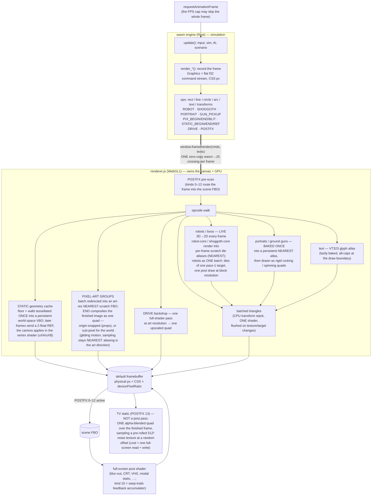
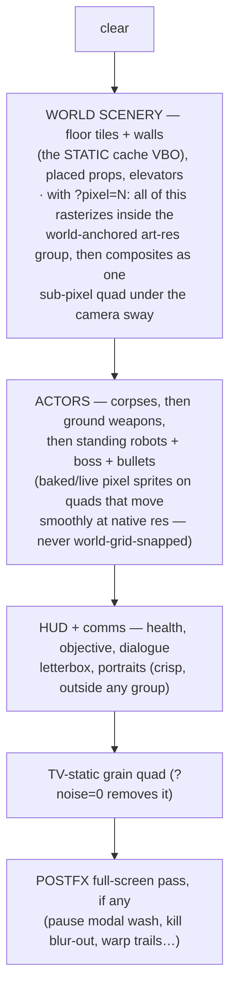

# The rendering pipeline

One frame, end to end. GitHub renders the mermaid blocks below as diagrams;
the same map, drawn by hand, lives at the dev server's `/docs` page
(docs.html — self-contained, no libraries, per the no-dependency rule).

## The big picture

The Rust/wasm engine owns the **simulation only**. Each frame it records
everything drawable into one flat `f32` command stream (CSS-pixel
coordinates) and hands it to JS **once** — a single zero-copy crossing.
`renderer.js` owns the canvas and the GPU: one batched triangle pipeline,
plus dedicated passes for the things a batch can't express.

## Anatomy of an in-game frame

Draw order inside `update_game`, top of the list = drawn first (underneath):

## What persists vs what is per-frame

| Persistent (built once, reused) | Per-frame |
| --- | --- |
| STATIC cache VBO (floor + walls of the current floor; evicted on floor change) | everything dynamic in the batch (actors, props' layers, HUD) |
| portrait / ground-gun atlas (baked per color / weapon on first use) | robot + boss tiles (LIVE 3D→2D, continuous animation time) |
| VT323 glyph atlas (grown lazily) | pixel-group scratch FBOs' contents (re-rasterized when used) |
| 512² TV-noise texture (rolled once at startup) | the noise quad's random UV offset |
| DRIVE / warp / scene FBO targets (allocated lazily, reused) | their contents |

## The cost model (why things are the way they are)

- **Bandwidth is the enemy** on fill-rate-poor GPUs at Retina: the
  framebuffer is physical-resolution, and every full-screen layer is a
  read (+ write) of ~4.5M pixels. MSAA (~4x that, per layer) was measured
  at 30 fps on the 2018 MacBook and removed; the TV grain (one blended
  quad = the cheapest possible full-screen overlay) still costs one
  read + write, which is visible on the FPS counter at cap 120.
- **The command stream is the CPU contract**: one crossing per frame,
  and the STATIC cache exists to shrink it (a floor's tiles + walls are
  ~2000 floats re-recorded per frame without it, 2 floats with it).
- **Art-res rasterization is a fill win**: a pixel group (or the DRIVE
  shader) computes at art resolution and pays native resolution only for
  one upscaled quad — the crunch and the savings come from the same place.
- **Aliasing is the art direction** (see CLAUDE.md ## Design): hard
  stair-stepped edges everywhere, smoothness only in motion (sub-pixel
  composite placement, continuous 60 fps animation).
